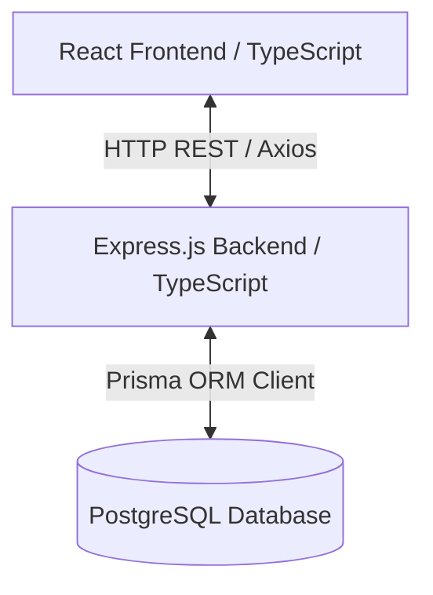
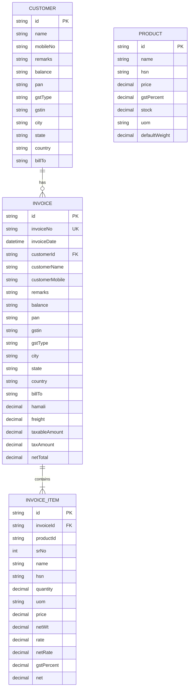
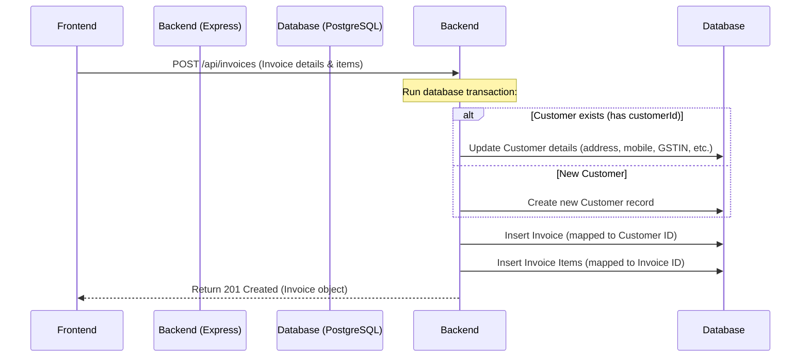

# Invoiso.ai Technical Documentation & Developer Reference

This document serves as a complete developer reference guide for the **Invoiso.ai** application. It details the project architecture, directory structures, data flows, component hierarchies, business calculation logic, schema constraints, configurations, and deployment procedures.

---

## 1. System Architecture Overview

Invoiso.ai is structured as a decoupled Client-Server application:
* **Frontend**: React application built with TypeScript, Vite, and Vanilla CSS. It provides a modular UI consisting of a traditional Invoicing Ledger Editor, a Wholesale POS Terminal with custom keyboard navigation, and an interactive Analytics Dashboard.
* **Backend**: Express.js server written in TypeScript. It exposes REST API endpoints for products, customers, invoices, and aggregated metrics.
* **Database**: PostgreSQL database queried via Prisma ORM client.



---

## 2. Project Structure

The repository is divided into two primary workspaces: `frontend` and `backend`. There is no shared helper package; types and utility configurations are managed locally in each workspace.

```
my-app/
├── backend/
│   ├── prisma/
│   │   └── schema.prisma        # Prisma schema and relationship configurations
│   ├── src/
│   │   ├── generated/prisma/    # Locally generated Prisma client files
│   │   └── index.ts             # Express server, route endpoints, and transaction logic
│   ├── tsconfig.json
│   └── package.json
├── frontend/
│   ├── public/                  # Static assets
│   ├── src/
│   │   ├── apiUtils/            # API integration modules (Axios client interfaces)
│   │   │   ├── analyticsApi.ts
│   │   │   ├── customersApi.ts
│   │   │   ├── invoicesApi.ts
│   │   │   └── productsApi.ts
│   │   ├── invoice/             # Traditional Invoicing components
│   │   │   ├── AddProductForm.tsx
│   │   │   ├── InvoicePage.tsx
│   │   │   ├── InvoicesListPage.tsx
│   │   │   ├── ProductListTable.tsx
│   │   │   ├── SummaryFooter.tsx
│   │   │   └── types.ts
│   │   ├── pos/                 # Point of Sale (POS) components
│   │   │   ├── POSCartSummary.tsx
│   │   │   ├── POSProductCard.tsx
│   │   │   ├── POSProductGrid.tsx
│   │   │   ├── WholesalePOSPage.tsx
│   │   │   └── types.ts
│   │   ├── print/               # PDF/HTML Print Engine components
│   │   │   ├── PrintInvoiceModal.tsx
│   │   │   ├── PrintSections.tsx
│   │   │   └── PrintTemplates.tsx
│   │   ├── Sidebar.tsx          # Shared layout and navigation component
│   │   ├── AnalyticsDashboardPage.tsx # Interactive analytics UI
│   │   ├── keyboardUtils.ts     # Global keyboard traversal helpers
│   │   ├── App.tsx              # React router setup and root application layout
│   │   ├── main.tsx
│   │   └── index.css            # Global stylesheets
│   ├── tsconfig.json
│   └── package.json
└── api_documentation.md         # API reference guide
```

---

## 3. Database Schema & Relational Models

The database models are configured in `backend/prisma/schema.prisma`. 

### Relational Entity-Relationship Diagram (ERD)



### Table Schemas and Constraints

1. **Product**: Stores the base product catalog list.
   * `id`: UUID Primary Key.
   * `price`: Decimal(12, 2) - Unit rate including GST.
   * `gstPercent`: Decimal(5, 2).
   * `stock`: Decimal(12, 3) - Current physical inventory count.
   * `defaultWeight`: Decimal(12, 3) (Nullable) - Base pack weight.
2. **Customer**: Records registered buyers.
   * `id`: UUID Primary Key.
   * `name`: String (Required).
   * `balance`: String (Nullable) - Represents the outstanding credit balance.
3. **Invoice**: Stores transaction metadata.
   * `id`: UUID Primary Key.
   * `invoiceNo`: String (Unique index).
   * `customerId`: UUID Foreign Key (onDelete: SetNull).
   * Other customer fields (`customerName`, `customerMobile`, `gstin`, `city`, `state`, etc.) are duplicated directly on the invoice record as a historical snapshot.
4. **InvoiceItem**: Itemized breakdown rows.
   * `id`: UUID Primary Key.
   * `invoiceId`: UUID Foreign Key (onDelete: Cascade).
   * `productId`: String (Nullable). Note: No hard Foreign Key constraint is mapped to the Product model, protecting historical records if a catalog product is deleted.

---

## 4. End-to-End Request/Data Flows

### A. Invoice Creation & Customer Sync Flow
When an invoice is saved, the frontend sends a POST request with the form data and selected items. The backend handles the creation and sync inside a single database transaction:




> **Stock Levels**: Creating an invoice does **not** update or decrement the product stock count in the database. Stock counts are only updated during manual product entry.

### B. POS Terminal Flow
1. **Catalog Retrieval**: POS requests `/api/products` on mount and stores items locally.
2. **Barcode / Code Input**: Operator types/selects items. Weight calculations are computed automatically in-memory.
3. **Cart Checkout**: Generates a standard Invoice payload and calls `POST /api/invoices`.

---

## 5. Component Hierarchy

### A. Traditional Invoicing (`InvoicePage`)
Located in [InvoicePage.tsx](file:///c:/Adinath/invoiso-demoui/my-app/frontend/src/invoice/InvoicePage.tsx):

```
InvoicePage (State: form, items, products, hamali, freight, discPercent, roundOff, showSummary)
├── Sidebar (State: sidebarOpen, activePage)
├── ProductListTable (Props: items, updateItem, deleteItem, columnConfig)
└── SummaryFooter (Props: totals, hamali, freight, discPercent, roundOff, handleSaveInvoice)
```

### B. Point of Sale (`WholesalePOSPage`)
Located in [WholesalePOSPage.tsx](file:///c:/Adinath/invoiso-demoui/my-app/frontend/src/pos/WholesalePOSPage.tsx):

```
WholesalePOSPage (State: cart, products, search, activeIndex, discountPercent, activeSection)
├── POSProductGrid (Props: products, addToCart)
│   └── POSProductCard (Props: product, onSelect)
└── POSCartSummary (Props: cart, totals, discountPercent, updateQuantity, handleCheckout)
```

---

## 6. Detailed Business Logic & Rules

### A. Tax & Price Calculation Rules
Prices stored in the database represent the **Unit Price including GST**. The backend and frontend calculate the base taxable rates back from this value:
* **Item Base Rate (Excluding Tax)**:
  $$\text{rate} = \frac{\text{Price including GST}}{1 + \frac{\text{GST \%}}{100}}$$
* **Line Net Value**:
  $$\text{net} = \text{quantity} \times \text{Price including GST}$$
* **Line Tax amount**:
  $$\text{tax} = \text{Line Net Value} - (\text{rate} \times \text{quantity})$$

### B. Discount & Rounding Calculations
* **Invoice Discount Amount**:
  $$\text{discountAmount} = \text{totalTaxable} \times \frac{\text{Discount \%}}{100}$$
* **Invoice Total Taxable (Logistics added)**:
  $$\text{finalTaxable} = \text{totalTaxable} - \text{discountAmount} + \text{hamali} + \text{freight}$$
* **Gross Invoice Total**:
  $$\text{grossTotal} = \text{netTotalValue} - \left(\text{netTotalValue} \times \frac{\text{Discount \%}}{100}\right) + \text{hamali} + \text{freight}$$
* **Final Payable Total (Rounded)**:
  $$\text{finalTotal} = \text{grossTotal} + \text{roundOff}$$

### C. Dynamic Weight Extraction (POS)
In the POS module, physical weights are parsed directly from product parameters. If `product.defaultWeight` is not explicitly set, the POS cart parses the name using a regex looking for `[number KG]`:
```typescript
const weightMatch = item.product.name.match(/\[(\d+)\s*KG\]/i);
const unitWeight = weightMatch ? parseFloat(weightMatch[1]) : 1;
const totalWeight = unitWeight * item.quantity;
```

### D. Invoice Number Sequence Builder
The API endpoint `/api/invoices/next-number` retrieves the last saved invoice ordered by `createdAt` desc:
- If no invoice exists, defaults to `"NHW-2627-0001"`.
- If an invoice is found, it extracts the suffix prefix matching `/^(.*-)(\d+)$/` (e.g. `NHW-2627-` and `0001`), increments the numeric suffix, and pads it to match the length of the previous suffix (e.g. `0002`).

---

## 7. Environment Configuration

### Backend Setup
Exposed in `backend/.env`:
* `DATABASE_URL`: Represents the PostgreSQL database connection pool string.
* Express runs on a hardcoded port: `5000` (e.g., `http://localhost:5000`).

### Frontend Setup
* There is no `.env` file on the frontend.
* The API target server URL is hardcoded globally inside the API files as:
  ```typescript
  const BACKEND_URL = 'http://localhost:5000';
  ```

---

## 8. Error & Transaction Handling

1. **Unique Constraint Violation**: If the invoice number already exists, Prisma throws error code `P2002`. The backend catches this code and responds with a `409 Conflict` status:
   ```json
   { "error": "Invoice number already exists." }
   ```
2. **Missing Parameters**: Requests to `POST /api/invoices` validate key properties. If `masterForm.name` or `masterForm.invoiceNo` is missing, it returns a `400 Bad Request`.
3. **Transaction Rollbacks**: Customer details update and invoice creations are wrapped inside a database `$transaction`. If any nested item insertion fails, the entire transaction reverts.

---

## 9. Production Build & Deployment

### Deployment Prerequisites & Infrastructure Requirements

To deploy the **Invoiso.ai** application, the production environment requires:
1. **Node.js Runtime**: Node.js `v18.x` or higher and `npm` package manager.
2. **Database System**: A PostgreSQL database (hosted locally or via a cloud database service like AWS RDS, Neon, or Supabase).
3. **Web Server / Reverse Proxy**: `Nginx` or `Apache` to act as a reverse proxy for the backend API and serve the static frontend client.
4. **Process Manager**: `PM2` or a Systemd service to run the Express backend server continuously in the background and automatically restart it on failures.

---

### Production Environment Variables

#### Backend Configuration (`backend/.env`)
* `PORT`: The port the Express application listens on (default is `5000`).
* `DATABASE_URL`: Connection pool URL to the production PostgreSQL database.
* `CORS_ORIGIN`: Allowed origins (e.g. `http://yourdomain.com`).

#### Frontend Configuration
* The base api URL is configured in `frontend/src/apiUtils/` files. Ensure the host address `http://localhost:5000` is changed to the production domain API URL (e.g., `https://api.yourdomain.com`) during the build process.

---

### Build Commands

1. **Backend Build Process**:
   Navigate to the `backend` directory:
   ```bash
   # Install dependencies
   npm install
   
   # Generate Prisma client artifacts
   npx prisma generate
   
   # Compile TypeScript files into build (dist/) directory
   npm run build
   ```

2. **Frontend Build Process**:
   Navigate to the `frontend` directory:
   ```bash
   # Install dependencies
   npm install
   
   # Build optimized static assets (HTML, CSS, JS) into dist/ folder
   npm run build
   ```

---

### Database Setup & Migrations

To apply database tables, indexes, and constraints to the target database:
1. Run migrations in your development environment to generate migration files:
   ```bash
   npx prisma migrate dev --name init
   ```
2. Apply pending migration scripts on the production database:
   ```bash
   npx prisma migrate deploy
   ```

---

### Process Execution & Serving

1. **Running the Backend (with PM2)**:
   ```bash
   pm2 start dist/index.js --name "invoiso-backend"
   ```

---

## 10. API Documentation Reference

Below is the exhaustive REST API endpoint schema mapping details.

### General Health Check
Check if the backend server is running correctly.
* **URL:** `/`
* **Method:** `GET`
* **Response:**
  * **200 OK**: `"Backend running"`

### Products API
1. **Get All Products**: Retrieves a list of all products in the database.
   * **URL:** `/api/products`
   * **Method:** `GET`
   * **Response:**
     * **200 OK**: Array of product objects.

2. **Create Product**: Adds a new product to the inventory database.
   * **URL:** `/api/products`
   * **Method:** `POST`
   * **Request Body Schema:**
     ```json
     {
       "name": "Refined Sunflower Oil",
       "hsn": "15121910",
       "price": 135.00,
       "gstPercent": 12.0,
       "stock": 50,
       "uom": "LITRE",
       "category": "Oil",
       "defaultWeight": 15.00
     }
     ```
   * **Response:**
     * **201 Created**: The newly created product object.
     * **400 Bad Request**: Missing required fields.

### Invoices API
1. **Get Next Invoice Number**: Computes and retrieves the next unique invoice sequence number (e.g. `NHW-2627-0002`).
   * **URL:** `/api/invoices/next-number`
   * **Method:** `GET`
   * **Response:**
     * **200 OK**: `{"nextInvoiceNo": "NHW-2627-0002"}`

2. **Get All Invoices**: Retrieves a list of all invoices. Supports optional datewise filtering.
   * **URL:** `/api/invoices`
   * **Method:** `GET`
   * **Query Parameters:**
     * `date` (optional): Filter invoices created on a specific date (Format: `YYYY-MM-DD`).
   * **Response:**
     * **200 OK**: Array of invoices including nested items and customer data.

3. **Create Invoice**: Creates a new invoice and its associated invoice items inside a database transaction.
   * **URL:** `/api/invoices`
   * **Method:** `POST`
   * **Response:**
     * **201 Created**: The newly created invoice metadata object.
     * **400 Bad Request**: Missing customer name, invoice number, or items.
     * **409 Conflict**: Invoice number already exists.

### Customers API
1. **Get All Customers**: Retrieves all customers in the database. Supports fuzzy name searching.
   * **URL:** `/api/customers`
   * **Method:** `GET`
   * **Query Parameters:**
     * `name` (optional): Filter customers whose name contains this search query (case-insensitive).
   * **Response:**
     * **200 OK**: Array of customers sorted by name.

2. **Get Customer by ID**: Retrieves details of a single customer along with their complete invoice history.
   * **URL:** `/api/customers/:id`
   * **Method:** `GET`
   * **Response:**
     * **200 OK**: Customer details with nested invoices and invoice items.
     * **404 Not Found**: Customer not found.

3. **Create Customer**: Registers a new customer.
   * **URL:** `/api/customers`
   * **Method:** `POST`
   * **Response:**
     * **201 Created**: The newly created customer object.

4. **Update Customer**: Updates details of an existing customer record.
   * **URL:** `/api/customers/:id`
   * **Method:** `PUT`
   * **Response:**
     * **200 OK**: Updated customer object.

5. **Delete Customer**: Deletes a customer by ID.
   * **URL:** `/api/customers/:id`
   * **Method:** `DELETE`
   * **Response:**
     * **200 OK**: `{"message": "Customer deleted successfully"}`

### Analytics API
1. **Sales Analytics**: Retrieves sales summaries, sales trends, top customer revenue, and city/state location breakdowns.
   * **URL:** `/api/analytics/sales`
   * **Method:** `GET`
   * **Query Parameters:**
     * `timeframe` (optional): Sets the analytics bucket. Options: `day` (last 30 days), `month` (last 12 months), `year` (last 5 years). Default: `day`.
   * **Response:**
     * **200 OK**: Sales summary structure with nested daily/monthly/yearly collections.

2. **Stock and Inventory Analytics**: Retrieves information on stock counts, stock value, category stock distributions, low-stock alerts, and top-selling products.
   * **URL:** `/api/analytics/stock`
   * **Method:** `GET`
   * **Response:**
     * **200 OK**: Inventory summary data.

